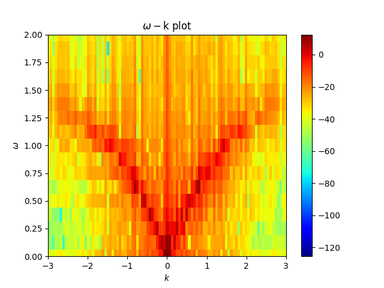

# 1D fluid simulation code (python version)

## Introduction 
It is python version of the 1D fluid simulation code used in the study of 
ion and electron acoustic solitary wave in the different plasma environment. 

Ref:
1. http://dx.doi.org/10.1063/1.4964478
2. http://dx.doi.org/10.1063/1.4991467
3. http://dx.doi.org/10.1029/2018JA026303
4. http://dx.doi.org/10.1063/1.5119993

To understand the methodology use in the development of code please 
refer [Lotekar et. al., Commun. NonlinearSci. Numer. Simul, 2019](http://dx.doi.org/10.1016/j.cnsns.2018.07.041)

In the code the module **"fluidplasma"** consist different functions used in
writing code for particular plasma system. 

## Fluid simulation codes 

The fluid simulation codes are written by using the different useful function from
package **"fluidplasma"**. In the following subsections, the information of
of some codes is give. 

### Ion acoustic solitary wave simulation 
In the package script **"ion_acoustic_solitary_wave_two_componunt_plasma.py"** simulate
ion acoustic solitary wave in the plasma which consist of the fluid ion and 
superthermal electron 

(Figure shows the wk (frequency-wavenumber) plot generated from the output)

## Credits
      
This software was developed by Ajay Lotekar ([ablotekar@gmail.com](ablotekar@gmail.com))
during PhD.

1D fluid simulation code to study the plasma waves in the different plasma environment. 